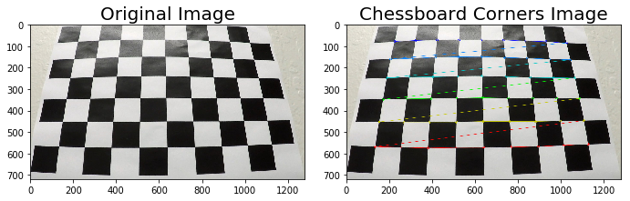
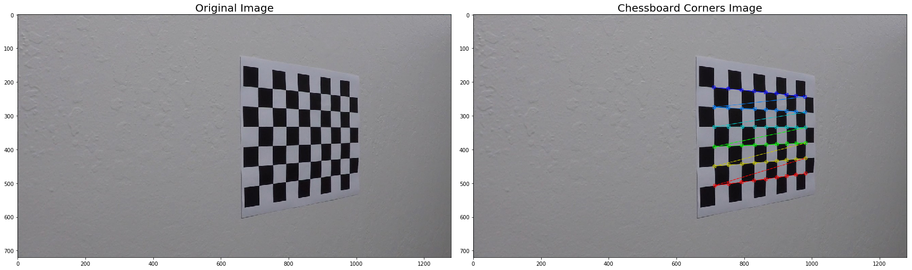
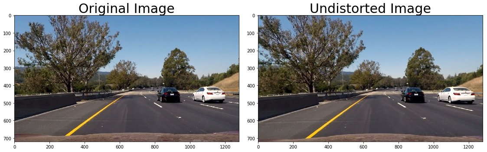
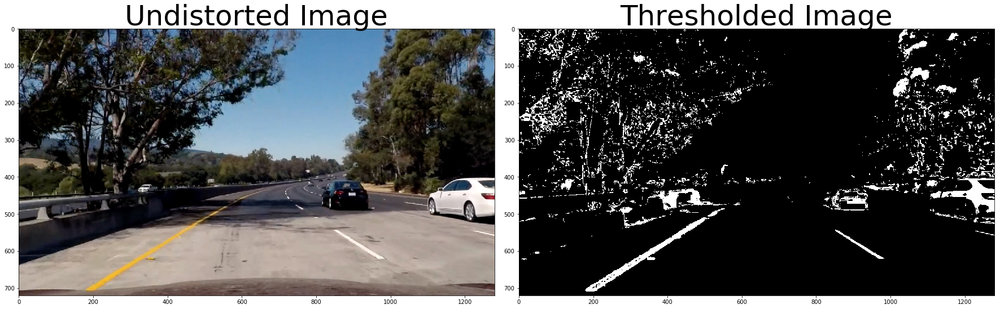
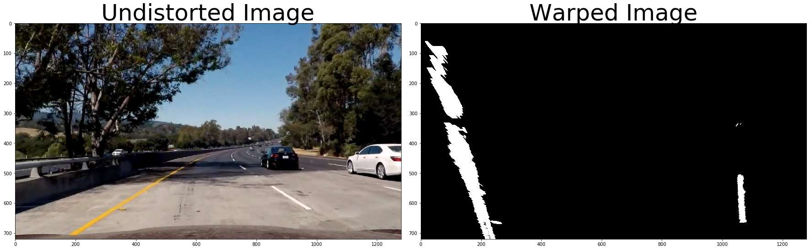
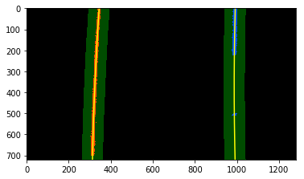
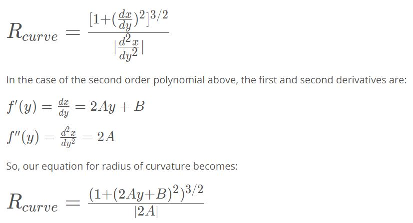
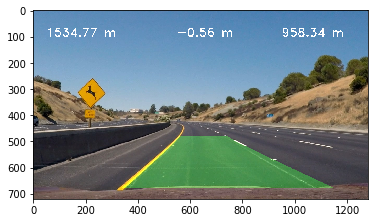

## README

---

**Advanced Lane Finding Project**

The goals / steps of this project are the following:

* Compute the camera calibration matrix and distortion coefficients given a set of chessboard images.
* Apply a distortion correction to raw images.
* Use color transforms, gradients, etc., to create a thresholded binary image.
* Apply a perspective transform to rectify binary image ("birds-eye view").
* Detect lane pixels and fit to find the lane boundary.
* Determine the curvature of the lane and vehicle position with respect to center.
* Warp the detected lane boundaries back onto the original image.
* Output visual display of the lane boundaries and numerical estimation of lane curvature and vehicle position.


## [Rubric](https://review.udacity.com/#!/rubrics/571/view) Points

---

### Writeup / README

#### 1. Provide a Writeup / README that includes all the rubric points and how I addressed each one.

You're reading it!

### Camera Calibration

#### 1. Briefly state how you computed the camera matrix and distortion coefficients. Provide an example of a distortion corrected calibration image.

I start by importing all the necessary libraries such as numpy, cv2, matplotlib, etc. Next I prepare "object points" which will be the (x,y,z) coordinates of the test images of chessboard conrers in the world. Assuming the chessboard is fixed on the (x,y) place at z=0, I get the object points being the same for each calibration image. "objpoints" will be appended every time I successfully detect all chessboard corners in a test image. Then, "imgpoints" will be appended with (x,y) position of each of the corners in the image plane of successful chessboard detection.

Then, using "objpoints" and "imgpoints" above, I can calibrate the camera by first drawing the patterns in the test image, and then compute the camera calibration and distortion coefficients using the 'cv2.calibrateCamera()' function. Finally, I can apply this distortion correction to test image using the 'cv2.undistort()' function and get the result, for example as followed:

[//]: # (Image References)



### Pipeline (single images)

#### 1. Provide an example of a distortion-corrected image.

Applying the distortion correction function above, I can get a sample undistorted image as followed:

[//]: # (Image References)


#### 2. Describe how I used color transforms, gradients or other methods to create a thresholded binary image.  Provide an example of a binary image result.

Via 'threshold' function, I used a combination of color and gradient thresholds to generate a binary image.
First, I use Sobel operator threshold of both x and y directions with sobel kernal 5, and take the gradient of them with threshold from 230 to 255
Second, I use HLS color channel, including S-channel for finding yellow lines with threshold from 230 to 255.
Third, I use LAB color channel, including B-channel for further supporting finding yellow lines with threshold from 150 to 200.
Finally, I use LUV color channel, including L-channel for finding white lines with threshold from 230 to 255.
After combining all those color and gradient threholds together, I get a binary image as followed:

[//]: # (Image References)


#### 3. Describe how I performed a perspective transform and provide an example of a transformed image.

This piece of code will be under the function 'perspective_transform()'. The function takes in a binary image obtained from the 'threshold()' function in the previous step. The function also takes four points in the input image as source 'src' and four points in the output image 'dst'. After that, the transformation matrix M is obtained with function 'cv2.getPerspectiveTransform()' and use it to get the output warped image with function 'cv2.warpPerspective()'.

```python
    src = np.float32(
        [[0,680],
         [1280,680],
         [800,480],
         [550,480]])
    
    # Four desired coordinates
    dst = np.float32(
        [[0,720],
         [1280,720],
         [1280,0],
         [0,0]]) 
```

This resulted in the following source and destination points:

| Source        | Destination   | 
|:-------------:|:-------------:| 
| 0, 680        | 0, 720        | 
| 1280, 680     | 1280, 720     |
| 800, 480      | 1280, 0       |
| 550, 480      | 0, 0          |

I verified that my perspective transform was working as expected by drawing the `src` and `dst` points onto a test image and its warped counterpart to verify that the lines appear parallel in the warped image.

[//]: # (Image References)



#### 4. Describe how I identified lane-line pixels and fit their positions with a polynomial?

Coming the find the lane pixels, I did a couple  of steps.
First, I make a histogram of visible pixels in a warped image obtained from the previous 'perspective_transform()' function, with the two peaks being the two starting position of left and right lanes.
Then, I use the trick of sliding windows (10 windows each image with width of 200 pixels) to capture the non-zero pixels within each window, and append their indices to the lists. If the number of pixels in a window surpasses a threhold number (set to be 50 pixels), we consider that to be good prediction of lane lines.
Next, we fit those predicted lane line indices in 2 second order polynomials, one for right line and one for left line, and drawing them on the image.
Finally, one optional step, is to search around the previously found lines with function 'search_around"poly()' so that we don't have to start searching from scratch everytime.

[//]: # (Image References)



#### 5. Describe how I calculated the radius of curvature of the lane and the position of the vehicle with respect to center.

To calculated the radius of the curvature of the lane, first I get the converter meters per pixel in both x and y directions.
Then, I use those values to fit polynomials in left and right lane lines in real world. I can then calculate the radius of left and right curvative via this formula:

[//]: # (Image References)


Next, I can find the offset of the car from the center of the lane (assumed the camera is mounted at the center of the car, which will be the center of the image) by taking the midpoint index of the left and right lane line indices. Finally, I take the difference between the center index of the image and that midpoint index, and convert the result to real world value. If the result is negative, which means the car is on the left of the lane center, and vice versa.
I also created the 'unwarp()' function to unwarp the warped image, and 'projection()' function to fill the detection lane with green color.




#### 6. Provide an example image of your result plotted back down onto the road such that the lane area is identified clearly.

I implemented this step in lines # through # in my code in `yet_another_file.py` in the function `map_lane()`.  Here is an example of my result on a test image:

![alt text][image6]

---

### Pipeline (video)

#### 1. Provide a link to your final video output.  Your pipeline should perform reasonably well on the entire project video (wobbly lines are ok but no catastrophic failures that would cause the car to drive off the road!).

Here's a [link to my video result](./project_video.mp4)

---

### Discussion

#### 1. Briefly discuss any problems / issues you faced in your implementation of this project.  Where will your pipeline likely fail?  What could you do to make it more robust?

Some parameters need to be tweaked in order to perform better image processing. Working on it!

Here I'll talk about the approach I took, what techniques I used, what worked and why, where the pipeline might fail and how I might improve it if I were going to pursue this project further.
