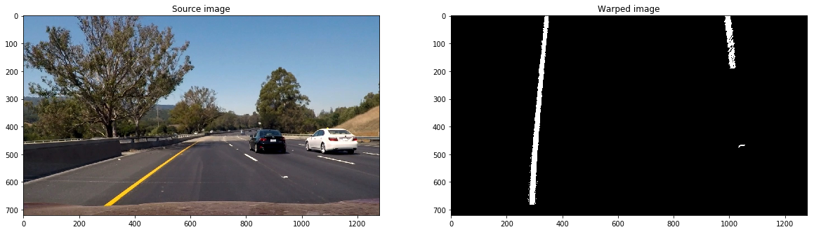
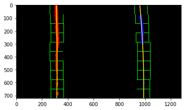
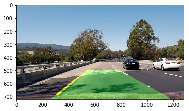

## README

---

**Advanced Lane Finding Project**

The goals / steps of this project are the following:

* Compute the camera calibration matrix and distortion coefficients given a set of chessboard images.
* Apply a distortion correction to raw images.
* Use color transforms, gradients, etc., to create a thresholded binary image.
* Apply a perspective transform to rectify binary image ("birds-eye view").
* Detect lane pixels and fit to find the lane boundary.
* Determine the curvature of the lane and vehicle position with respect to center.
* Warp the detected lane boundaries back onto the original image.
* Output visual display of the lane boundaries and numerical estimation of lane curvature and vehicle position.


## [Rubric](https://review.udacity.com/#!/rubrics/571/view) Points

---

### Writeup / README

#### 1. Provide a Writeup / README that includes all the rubric points and how I addressed each one.

You're reading it!

### Camera Calibration

#### 1. Briefly state how you computed the camera matrix and distortion coefficients. Provide an example of a distortion corrected calibration image.

I start by importing all the necessary libraries such as numpy, cv2, matplotlib, etc. Next I prepare "object points" which will be the (x,y,z) coordinates of the test images of chessboard conrers in the world. Assuming the chessboard is fixed on the (x,y) place at z=0, I get the object points being the same for each calibration image. "objpoints" will be appended every time I successfully detect all chessboard corners in a test image. Then, "imgpoints" will be appended with (x,y) position of each of the corners in the image plane of successful chessboard detection.

Then, using "objpoints" and "imgpoints" above, I can calibrate the camera by first drawing the patterns in the test image, and then compute the camera calibration and distortion coefficients using the 'cv2.calibrateCamera()' function. Finally, I can apply this distortion correction to test image using the 'cv2.undistort()' function and get the result, for example as followed:

[//]: # (Image References)


### Pipeline (single images)

#### 1. Provide an example of a distortion-corrected image.

Applying the distortion correction function above, I can get a sample undistorted image as followed:

[//]: # (Image References)


#### 2. Describe how I used color transforms, gradients or other methods to create a thresholded binary image.  Provide an example of a binary image result.

I used a combination of color and gradient thresholds to generate a binary image.
First, I use Sobel operator threshold of both x and y directions with sobel kernal 5, and take the gradient of them with threshold from 230 to 255
Second, I use HLS color channel, including S-channel for finding yellow lines with threshold from 230 to 255.
Third, I use LAB color channel, including B-channel for further supporting finding yellow lines with threshold from 150 to 200.
Finally, I use LUV color channel, including L-channel for finding white lines with threshold from 230 to 255.
After combining all those color and gradient threholds together, I get a binary image as followed:

[//]: # (Image References)


#### 3. Describe how (and identify where in your code) you performed a perspective transform and provide an example of a transformed image.

The code for my perspective transform includes a function called `perspective_transform()`, which appears in lines 1 through 8 in the file `example.py` (output_images/examples/example.py) (or, for example, in the 3rd code cell of the IPython notebook).  The `perspective_transform()` function takes as inputs an image (`img`), as well as source (`src`) and destination (`dst`) points.  I chose the hardcode the source and destination points in the following manner:

```python
    src = np.float32(
        [[150,720],
         [1100,720],
         [800,500],
         [500,500]])
    
    # Four desired coordinates
    dst = np.float32(
        [[200,720],
         [1000,720],
         [1000,0],
         [200,0]]) 
```

This resulted in the following source and destination points:

| Source        | Destination   | 
|:-------------:|:-------------:| 
| 150, 720      | 200, 720      | 
| 1100, 720     | 1000, 720     |
| 800, 500      | 1000, 0       |
| 500, 500      | 200, 0        |

I verified that my perspective transform was working as expected by drawing the `src` and `dst` points onto a test image and its warped counterpart to verify that the lines appear parallel in the warped image.

[//]: # (Image References)



#### 4. Describe how (and identify where in your code) you identified lane-line pixels and fit their positions with a polynomial?

Then I did some other stuff and fit my lane lines with a 2nd order polynomial kinda like this:

[//]: # (Image References)



#### 5. Describe how (and identify where in your code) you calculated the radius of curvature of the lane and the position of the vehicle with respect to center.

I did this in lines # through # in my code in `my_other_file.py`

[//]: # (Image References)


#### 6. Provide an example image of your result plotted back down onto the road such that the lane area is identified clearly.

I implemented this step in lines # through # in my code in `yet_another_file.py` in the function `map_lane()`.  Here is an example of my result on a test image:

![alt text][image6]

---

### Pipeline (video)

#### 1. Provide a link to your final video output.  Your pipeline should perform reasonably well on the entire project video (wobbly lines are ok but no catastrophic failures that would cause the car to drive off the road!).

Here's a [link to my video result](./project_video.mp4)

---

### Discussion

#### 1. Briefly discuss any problems / issues you faced in your implementation of this project.  Where will your pipeline likely fail?  What could you do to make it more robust?

Some parameters need to be tweaked in order to perform better image processing. Working on it!

Here I'll talk about the approach I took, what techniques I used, what worked and why, where the pipeline might fail and how I might improve it if I were going to pursue this project further.
